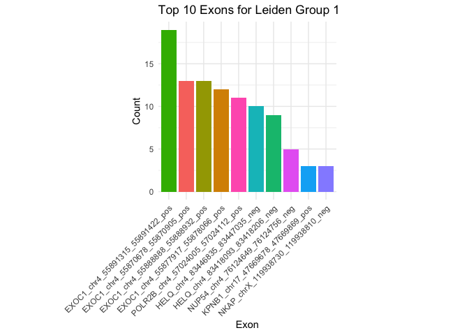

scCHyMErA-Seq
================
Wilfried Guiblet
2025-03-25

# Create Environment

``` bash

cd /mnt/gridftp/guibletwm/CCBRRBL13/share_data
module load mamba
#conda create -n pertpy 
conda activate pertpy
#pip install anndata scanpy mudata muon pertpy pydeseq2
```

# Proportion Analysis - Genes

``` r
obs = read.csv('/Users/guibletwm/Lab_Work/CCRRBL-13/bandana/KO.perturb_only_cells/obs.csv')
data <- obs[,c('Exon','leiden')]

# Count occurrences of Exon within each leiden group
exon_count_in_groups <- data %>%
  group_by(leiden, Exon) %>%
  summarise(count = n(), .groups = "drop") %>%
  arrange(leiden, desc(count), Exon) # Sort by count and Exon name for tie-breaking

total_count = nrow(data['Exon'])

exon_count_in_all_groups <- data %>%
  group_by(Exon) %>%
  summarise(total_count = sum(n()), .groups = "drop") %>%
  arrange(desc(total_count))
  
total_count_in_groups <- data %>%
  group_by(leiden) %>%
  summarise(total_count = sum(n()), .groups = "drop") %>%
  arrange(desc(total_count))


# Create an empty dataframe to store results
fisher_results <- data.frame(
  Exon = character(),
  leiden = character(),
  p_value = numeric(),
  odds_ratio = numeric(),
  stringsAsFactors = FALSE
)

# Loop through Exon and leiden groups
for (exon in exon_count_in_all_groups$Exon) {
  
  for (group in total_count_in_groups$leiden) {
    
    # Extract counts safely
    exon_count <- exon_count_in_groups$count[which(exon_count_in_groups$Exon == exon & exon_count_in_groups$leiden == group)]
    total_exon_count <- exon_count_in_all_groups$total_count[which(exon_count_in_all_groups$Exon == exon)]
    group_total_count <- total_count_in_groups$total_count[which(total_count_in_groups$leiden == group)]
    
    # Ensure values are not empty (to avoid indexing errors)
    if (length(exon_count) == 0) exon_count <- 0
    if (length(total_exon_count) == 0) total_exon_count <- 0
    if (length(group_total_count) == 0) group_total_count <- 0
    
    # Perform Fisher's exact test
    fisher_result <- fisher.test(matrix(
      c(exon_count, total_exon_count, group_total_count, total_count),
      nrow = 2
    ))

    # Append results to dataframe
    fisher_results <- rbind(fisher_results, data.frame(
      Exon = exon,
      leiden = group,
      p_value = fisher_result$p.value,
      odds_ratio = fisher_result$estimate
    ))
  }
}

fisher_results$padj <- p.adjust(fisher_results$p_value, method = "holm")


# View the stored Fisher test results
#print(fisher_results)

write.table(fisher_results, '/Users/guibletwm/Lab_Work/CCRRBL-13/bandana/KO_fisher.tsv', sep = '\t', row.names = FALSE)

# Filter the top 10 most common entries for each leiden group, ensuring exactly 10 rows
top10 <- exon_count_in_groups %>%
  group_by(leiden) %>%
  slice_head(n = 10) %>% # Keep exactly 10 rows per leiden group
  ungroup()

# Create individual plots for each leiden group
plots <- list()
unique_leiden <- unique(top10$leiden)

for (l in unique_leiden) {
  # Filter data for the current leiden group
  leiden_data <- top10 %>% filter(leiden == l)
  
  # Generate the plot
  p <- ggplot(leiden_data, aes(x = reorder(Exon, -count), y = count, fill = Exon)) +
    geom_bar(stat = "identity") +
    theme_minimal() +
    labs(
      title = paste("Top 10 Exons for Leiden Group", l),
      x = "Exon",
      y = "Count",
      fill = "Exon"
    ) +
    theme(axis.text.x = element_text(angle = 45, hjust = 1)) +
    theme(legend.position = "none", aspect.ratio = 1)
    #guides(fill = guide_legend(title = "Exon"))
  
  # Add the plot to the list
  plots[[paste0("leiden_", l)]] <- p
}


# View plots (as separate outputs)
plots$leiden_0 # View plot for leiden group 0
```

<!-- -->

``` r
plots$leiden_1 # View plot for leiden group 1
```

<!-- -->

``` r
plots$leiden_2 # View plot for leiden group 2
```

<!-- -->

``` r
plots$leiden_3 # View plot for leiden group 3
```

<!-- -->

``` r
plots$leiden_4 # View plot for leiden group 4
```

<!-- -->

``` r
plots$leiden_5 # View plot for leiden group 5
```

<!-- -->

``` r
plots$leiden_6 # View plot for leiden group 6
```

<!-- -->

# Proportion Analysis - Exons

## By Exon

``` r
obs = read.csv('/Users/guibletwm/Lab_Work/CCRRBL-13/bandana/Exon.perturb_only_cells/obs.csv')

data <- obs[,c('Exon','leiden')]

# Count occurrences of Exon within each leiden group
exon_count_in_groups <- data %>%
  group_by(leiden, Exon) %>%
  summarise(count = n(), .groups = "drop") %>%
  arrange(leiden, desc(count), Exon) # Sort by count and Exon name for tie-breaking

total_count = nrow(data['Exon'])

exon_count_in_all_groups <- data %>%
  group_by(Exon) %>%
  summarise(total_count = sum(n()), .groups = "drop") %>%
  arrange(desc(total_count))
  
total_count_in_groups <- data %>%
  group_by(leiden) %>%
  summarise(total_count = sum(n()), .groups = "drop") %>%
  arrange(desc(total_count))


# Create an empty dataframe to store results
fisher_results <- data.frame(
  Exon = character(),
  leiden = character(),
  p_value = numeric(),
  odds_ratio = numeric(),
  stringsAsFactors = FALSE
)

# Loop through Exon and leiden groups
for (exon in exon_count_in_all_groups$Exon) {
  
  for (group in total_count_in_groups$leiden) {
    
    # Extract counts safely
    exon_count <- exon_count_in_groups$count[which(exon_count_in_groups$Exon == exon & exon_count_in_groups$leiden == group)]
    total_exon_count <- exon_count_in_all_groups$total_count[which(exon_count_in_all_groups$Exon == exon)]
    group_total_count <- total_count_in_groups$total_count[which(total_count_in_groups$leiden == group)]
    
    # Ensure values are not empty (to avoid indexing errors)
    if (length(exon_count) == 0) exon_count <- 0
    if (length(total_exon_count) == 0) total_exon_count <- 0
    if (length(group_total_count) == 0) group_total_count <- 0
    
    # Perform Fisher's exact test
    fisher_result <- fisher.test(matrix(
      c(exon_count, total_exon_count, group_total_count, total_count),
      nrow = 2
    ))

    # Append results to dataframe
    fisher_results <- rbind(fisher_results, data.frame(
      Exon = exon,
      leiden = group,
      p_value = fisher_result$p.value,
      odds_ratio = fisher_result$estimate
    ))
    
  }
}

fisher_results$padj <- p.adjust(fisher_results$p_value, method = "holm")

# View the stored Fisher test results
#print(fisher_results)

write.table(fisher_results, '/Users/guibletwm/Lab_Work/CCRRBL-13/bandana/exon_fisher.tsv', sep = '\t', row.names = FALSE)


# Filter the top 10 most common entries for each leiden group, ensuring exactly 10 rows
top10 <- exon_count_in_groups %>%
  group_by(leiden) %>%
  slice_head(n = 10) %>% # Keep exactly 10 rows per leiden group
  ungroup()

# Create individual plots for each leiden group
plots <- list()
unique_leiden <- unique(top10$leiden)

for (l in unique_leiden) {
  # Filter data for the current leiden group
  leiden_data <- top10 %>% filter(leiden == l)
  
  # Generate the plot
  p <- ggplot(leiden_data, aes(x = reorder(Exon, -count), y = count, fill = Exon)) +
    geom_bar(stat = "identity") +
    theme_minimal() +
    labs(
      title = paste("Top 10 Exons for Leiden Group", l),
      x = "Exon",
      y = "Count",
      fill = "Exon"
    ) +
    theme(axis.text.x = element_text(angle = 45, hjust = 1)) +
    theme(legend.position = "none", aspect.ratio = 1)
    #guides(fill = guide_legend(title = "Exon"))
  
  # Add the plot to the list
  plots[[paste0("leiden_", l)]] <- p
}


# View plots (as separate outputs)
plots$leiden_0 # View plot for leiden group 0
```

<!-- -->

``` r
plots$leiden_1 # View plot for leiden group 1
```

<!-- -->

``` r
plots$leiden_2 # View plot for leiden group 2
```

<!-- -->

``` r
plots$leiden_3 # View plot for leiden group 3
```

<!-- -->

``` r
plots$leiden_4 # View plot for leiden group 4
```

<!-- -->

``` r
plots$leiden_5 # View plot for leiden group 5
```

<!-- -->

``` r
plots$leiden_6 # View plot for leiden group 6
```

<!-- -->

## By Gene

``` r
obs = read.csv('/Users/guibletwm/Lab_Work/CCRRBL-13/bandana/Exon.perturb_only_cells/obs.csv')
data <- obs[,c('Gene','leiden')]

# Count occurrences of Exon within each leiden group, excluding 'intergenic'
Gene_count_in_groups <- data %>%
#  filter(Exon != "intergenic") %>% # Exclude 'intergenic'
  group_by(leiden, Gene) %>%
  summarise(count = n(), .groups = "drop") %>%
  arrange(leiden, desc(count), Gene) # Sort by count and Exon name for tie-breaking

total_count = nrow(data['Gene'])

Gene_count_in_all_groups <- data %>%
  group_by(Gene) %>%
  summarise(total_count = sum(n()), .groups = "drop") %>%
  arrange(desc(total_count))
  
total_count_in_groups <- data %>%
  group_by(leiden) %>%
  summarise(total_count = sum(n()), .groups = "drop") %>%
  arrange(desc(total_count))


# Create an empty dataframe to store results
fisher_results <- data.frame(
  Gene = character(),
  leiden = character(),
  p_value = numeric(),
  odds_ratio = numeric(),
  stringsAsFactors = FALSE
)

# Loop through Gene and leiden groups
for (Gene in Gene_count_in_all_groups$Gene) {
  
  for (group in total_count_in_groups$leiden) {
    
    # Extract counts safely
    Gene_count <- Gene_count_in_groups$count[which(Gene_count_in_groups$Gene == Gene & Gene_count_in_groups$leiden == group)]
    total_Gene_count <- Gene_count_in_all_groups$total_count[which(Gene_count_in_all_groups$Gene == Gene)]
    group_total_count <- total_count_in_groups$total_count[which(total_count_in_groups$leiden == group)]
    
    # Ensure values are not empty (to avoid indexing errors)
    if (length(Gene_count) == 0) exon_count <- 0
    if (length(total_Gene_count) == 0) total_Gene_count <- 0
    if (length(group_total_count) == 0) group_total_count <- 0
    
    # Perform Fisher's exact test
    fisher_result <- fisher.test(matrix(
      c(Gene_count, total_Gene_count, group_total_count, total_count),
      nrow = 2
    ))

    # Append results to dataframe
    fisher_results <- rbind(fisher_results, data.frame(
      Gene = Gene,
      leiden = group,
      p_value = fisher_result$p.value,
      odds_ratio = fisher_result$estimate
    ))
    
  }
}

fisher_results$padj <- p.adjust(fisher_results$p_value, method = "holm")

# View the stored Fisher test results
#print(fisher_results)

write.table(fisher_results, '/Users/guibletwm/Lab_Work/CCRRBL-13/bandana/exon_bygene_fisher.tsv', sep = '\t', row.names = FALSE)
```

# Summarize gost (gProfiler) analysis

``` python
# merge_gost.py
import pandas as pd
import glob
import sys

def merge_transposed_dataframes(file_paths, columns_to_keep):
    """
    Merges a list of CSV files, ensuring that:
    - Files with only two columns and multiple rows are transposed, making the first column the header
      and the second column the only row.
    - Only specified columns are retained for merging.

    Parameters:
    - file_paths (list): List of file paths to CSV files.
    - columns_to_keep (list): List of column names to retain after transposition.

    Returns:
    - pd.DataFrame: A merged DataFrame containing the specified columns from all valid files.
    """
    dataframes = []

    for file in file_paths:
        df = pd.read_csv(file)

        # Transpose if the dataframe has only two columns and multiple rows
        if df.shape[1] == 2 and df.shape[0] > 1:
            df = df.set_index(df.columns[0]).transpose().reset_index(drop=True)

        # Keep only the desired columns if they exist
        if all(col in df.columns for col in columns_to_keep):
            dataframes.append(df[columns_to_keep])

    # Merge non-empty DataFrames
    return pd.concat(dataframes, axis=0).reset_index(drop=True)

def main(file_paths, output):
    columns_to_keep = ['query', 'p_value', 'source', 'term_name', 'highlighted', 'term_size', 'term_id']
    merged_df = merge_transposed_dataframes(file_paths, columns_to_keep)
    merged_df.to_csv(output, index=False)
    print(f"Merged data saved to {output}")

if __name__ == "__main__":
    file_paths = glob.glob(sys.argv[1]+"/*.csv")  # Update this path as needed
    output = sys.argv[2]  # Define your output file
    main(file_paths, output)
```

``` bash
#python merge_gost.py /data/RBL_NCI/mcintoshc/ccbrrbl13_files/MODS/DEG_exons_mod/results_custom_bkg/ DEG_exons.gost_results_merged.csv
#python merge_gost.py /data/RBL_NCI/mcintoshc/ccbrrbl13_files/MODS/DEG_genes_mod/results_custom_bkg/ DEG_genes.gost_results_merged.csv

python merge_gost.py /data/RBL_NCI/mcintoshc/ccbrrbl13_files/gProfilerRuns/2025_03_19/deg_exons_mod_0.5/results_custom_bkg/ DEG_exons.gost_results_merged.csv
python merge_gost.py /data/RBL_NCI/mcintoshc/ccbrrbl13_files/gProfilerRuns/2025_03_19/deg_genes_mod_0.5/results_custom_bkg/ DEG_genes.gost_results_merged.csv
```

if (!require(“BiocManager”, quietly = TRUE))
install.packages(“BiocManager”)

BiocManager::install(“rrvgo”) BiocManager::install(“org.Hs.eg.db”)

``` r
library(pheatmap)
library(rrvgo)
library(org.Hs.eg.db)
library(dplyr)


gost_results = read.csv('/Users/guibletwm/Lab_Work/CCRRBL-13/bandana/DEG_exons.gost_results_merged.csv', row.names = NULL)


gost_results$query <- gsub("^Group_\\d+_", "", gost_results$query)  # Remove "Group_###_"
gost_results$query <- gsub(" - Custom Background$", "", gost_results$query)  # Remove ending text


gost_results <- gost_results[which(gost_results$term_size <= 250),]
gost_results <- gost_results[gost_results$source %in% c("GO:BP", "GO:MF", "KEGG"), ]
#gost_results <- gost_results[which(gost_results$term_name != 'binding'),]
#gost_results <- gost_results[which(gost_results$term_name != 'molecular_function'),]
#gost_results <- gost_results[which(gost_results$term_name != 'biological_process'),]
#gost_results <- gost_results[which(gost_results$term_name != 'cellular_component'),]
#gost_results <- gost_results[which(gost_results$highlighted == 'True' or gost_results$highlighted == 'TRUE'),]

# Reduce terms with rvvgo
simMatrix <- calculateSimMatrix(gost_results$term_id,
                                orgdb="org.Hs.eg.db",
                                ont="BP",
                                method="Rel")

scores <- setNames(-log10(gost_results$p_value), gost_results$term_id)
reducedTerms <- reduceSimMatrix(simMatrix,
                                scores,
                                threshold=0.7,
                                orgdb="org.Hs.eg.db")

# Select the row with the highest score for each cluster
reducedTerms <- reducedTerms %>%
  group_by(cluster) %>%
  slice_max(order_by = score, n = 1) %>%
  ungroup()


reducedTerms$term_id <- reducedTerms$go
reduced_gost_results <- merge(gost_results, reducedTerms, by = 'term_id')


# Reshape data into matrix format
heatmap_data <- reshape2::acast(reduced_gost_results, `query` ~ `term_name`, value.var = "p_value")
heatmap_data[is.na(heatmap_data)] <- 1  # Common for metrics where zero is meaningful

# Filter term_name with at least two non-zero values
#heatmap_data <- heatmap_data[, colSums(heatmap_data != 1) >= 2]
#heatmap_data <- heatmap_data[rowSums(heatmap_data != 1) >= 2, ]

#rownames(heatmap_data) <- substr(rownames(heatmap_data), 1, 15)  # First 15 characters
#colnames(heatmap_data) <- substr(colnames(heatmap_data), 1, 5)

# Generate the heatmap with clustering

pdf(file="/Users/guibletwm/Lab_Work/CCRRBL-13/bandana/gost_heatmap.exons.pdf", width=20, height=8)

pheatmap(heatmap_data, 
         color = colorRampPalette(c("red", "orange", "white"))(100),
         clustering_distance_rows = "euclidean",
         clustering_distance_cols = "euclidean",
         clustering_method = "average",
         fontsize_row = 8, fontsize_col = 8,
         angle_col = 315)
```

<!-- -->

``` r
dev.off()
```

    ## pdf 
    ##   3

``` r
library(pheatmap)
library(rrvgo)
library(org.Hs.eg.db)

gost_results = read.csv('/Users/guibletwm/Lab_Work/CCRRBL-13/bandana/DEG_genes.gost_results_merged.csv', row.names = NULL)


gost_results$query <- gsub("^Group_\\d+_", "", gost_results$query)  # Remove "Group_###_"
gost_results$query <- gsub(" - Custom Background$", "", gost_results$query)  # Remove ending text

gost_results <- gost_results[which(gost_results$term_size <= 250),]
gost_results <- gost_results[gost_results$source %in% c("GO:BP", "GO:MF", "KEGG"), ]
#gost_results <- gost_results[which(gost_results$term_name != 'binding'),]
#gost_results <- gost_results[which(gost_results$term_name != 'molecular_function'),]
#gost_results <- gost_results[which(gost_results$term_name != 'biological_process'),]
#gost_results <- gost_results[which(gost_results$term_name != 'cellular_component'),]
#gost_results <- gost_results[which(gost_results$highlighted == 'True' or gost_results$highlighted == 'TRUE'),]


# Reduce terms with rvvgo
simMatrix <- calculateSimMatrix(gost_results$term_id,
                                orgdb="org.Hs.eg.db",
                                ont="BP",
                                method="Rel")

scores <- setNames(-log10(gost_results$p_value), gost_results$term_id)
reducedTerms <- reduceSimMatrix(simMatrix,
                                scores,
                                threshold=0.7,
                                orgdb="org.Hs.eg.db")

# Select the row with the highest score for each cluster
reducedTerms <- reducedTerms %>%
  group_by(cluster) %>%
  slice_max(order_by = score, n = 1) %>%
  ungroup()


reducedTerms$term_id <- reducedTerms$go
reduced_gost_results <- merge(gost_results, reducedTerms, by = 'term_id')


# Reshape data into matrix format
heatmap_data <- reshape2::acast(reduced_gost_results, `query` ~ `term_name`, value.var = "p_value")
heatmap_data[is.na(heatmap_data)] <- 1  # Common for metrics where zero is meaningful


# Filter term_name with at least two non-zero values
#heatmap_data <- heatmap_data[, colSums(heatmap_data != 1) >= 2]
#heatmap_data <- heatmap_data[rowSums(heatmap_data != 1) >= 2, ]

#rownames(heatmap_data) <- substr(rownames(heatmap_data), 1, 15)  # First 15 characters
#colnames(heatmap_data) <- substr(colnames(heatmap_data), 1, 5)

# Generate the heatmap with clustering

pdf(file="/Users/guibletwm/Lab_Work/CCRRBL-13/bandana/gost_heatmap.genes.pdf", width=20, height=8)

pheatmap(heatmap_data, 
         color = colorRampPalette(c("red", "orange", "white"))(100),
         clustering_distance_rows = "euclidean",
         clustering_distance_cols = "euclidean",
         clustering_method = "average",
         fontsize_row = 8, fontsize_col = 8,
         angle_col = 315)
```

<!-- -->

``` r
dev.off()
```

    ## pdf 
    ##   3

``` r
library(pheatmap)

gost_genes = read.csv('/Users/guibletwm/Lab_Work/CCRRBL-13/bandana/DEG_genes.gost_results_merged.csv', row.names = NULL)
gost_exons = read.csv('/Users/guibletwm/Lab_Work/CCRRBL-13/bandana/DEG_exons.gost_results_merged.csv', row.names = NULL)

gost_results <- rbind(gost_genes,gost_exons)

gost_results$query <- gsub("^Group_\\d+_", "", gost_results$query)  # Remove "Group_###_"
gost_results$query <- gsub(" - Custom Background$", "", gost_results$query)  # Remove ending text

gost_results <- gost_results[which(gost_results$term_size <= 250),]
gost_results <- gost_results[gost_results$source %in% c("GO:BP", "GO:MF", "KEGG"), ]

# Reduce terms with rvvgo
simMatrix <- calculateSimMatrix(gost_results$term_id,
                                orgdb="org.Hs.eg.db",
                                ont="BP",
                                method="Rel")

scores <- setNames(-log10(gost_results$p_value), gost_results$term_id)
reducedTerms <- reduceSimMatrix(simMatrix,
                                scores,
                                threshold=0.7,
                                orgdb="org.Hs.eg.db")

# Select the row with the highest score for each cluster
reducedTerms <- reducedTerms %>%
  group_by(cluster) %>%
  slice_max(order_by = score, n = 1) %>%
  ungroup()

reducedTerms$term_id <- reducedTerms$go
reduced_gost_results <- merge(gost_results, reducedTerms, by = 'term_id')


# Reshape data into matrix format
heatmap_data <- reshape2::acast(reduced_gost_results, `query` ~ `term_name`, value.var = "p_value")
heatmap_data[is.na(heatmap_data)] <- 1  # Common for metrics where zero is meaningful


# Filter term_name with at least two non-zero values
heatmap_data <- heatmap_data[, colSums(heatmap_data != 1) >= 2]


pdf(file="/Users/guibletwm/Lab_Work/CCRRBL-13/bandana/gost_heatmap.genes+exons.pdf", width=25, height=15)
pheatmap(heatmap_data, 
         color = colorRampPalette(c("red", "orange", "white"))(100),
         clustering_distance_rows = "euclidean",
         clustering_distance_cols = "euclidean",
         clustering_method = "average",
         fontsize_row = 8, fontsize_col = 8,
         angle_col = 315)
```

<!-- -->

``` r
dev.off()
```

    ## pdf 
    ##   3
